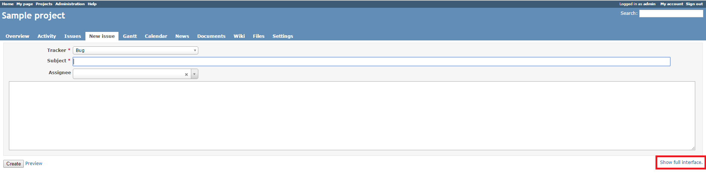
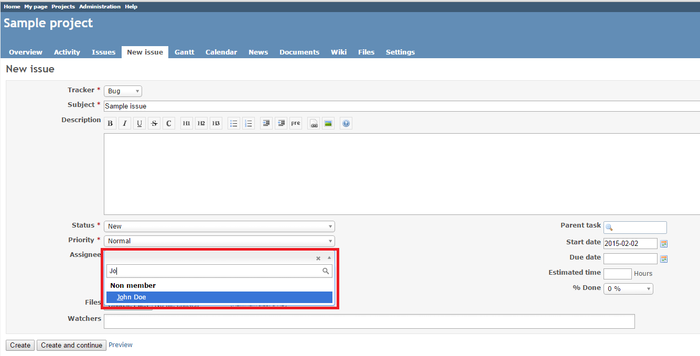
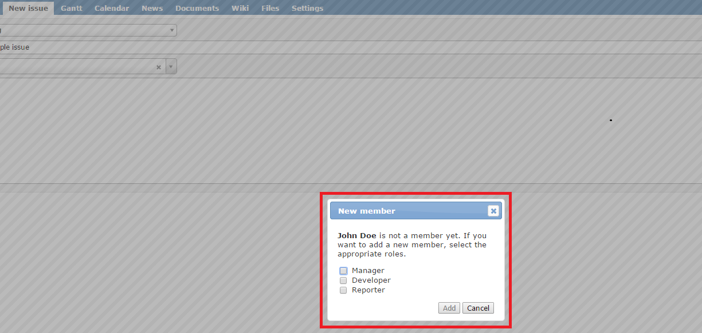

# Redmine Simple Plugin

This plugin adds a simple issue form to Redmine. It replaces a standard **Select** control with **Select2** (in the **Assignee** and **Watchers** fields), which allows you to search assignees and watchers by name, letters in name and surname, email or login. The plugin also simplifies the process of adding a new member to a project, which can be done directly when selecting an assignee.

## Compatibility

This plugin version is compatible only with Redmine 2.1.x and later.

## Installation

*These installation instructions are based on Redmine 2.x. For instructions for Redmine 1.x, see [Redmine wiki](http://www.redmine.org/projects/redmine/wiki/Plugins).*

This plugin requires Redmine Select2 Plugin to be installed. 

1. To install the plugins
    * Download the .ZIP archives, extract files and copy the plugin directories into #{REDMINE_ROOT}/plugins.
    
    Or

    * Change you current directory to your Redmine root directory:  

            cd {REDMINE_ROOT}
            
      Copy the plugins from GitHub using the following commands:
      
            git clone https://github.com/Undev/redmine__select2 plugins/redmine__select2
            git clone https://github.com/Undev/redmine_simple.git plugins/redmine_simple
            
2. Update the Gemfile.lock file, the local package index and install the dependencies:  

            rm Gemfile.lock
            sudo apt-get update
            sudo apt-get install -y libxml2-dev libxslt-dev libpq-dev
            bundle install

3. Restart Redmine.

## Usage

When you create or edit an issue, this plugin allows you to switch between a simple and a standard issue form by clicking the **Show simple interface** / **Show full interface** in the lower-right corner.  
  

The plugin changes the visual appearance of the **Assignee** and **Watchers** selectors.  

You can search users in the **Assignee** and **Watchers** fields by name, letters in name and surname, email or login.

If you select an assignee who is not a project member yet, you can add this user to the list of project members directly from the issue form by checking the appropriate roles.  

## License

Copyright (c) 2014 Undev

Licensed under the Apache License, Version 2.0 (the "License");
you may not use this file except in compliance with the License.
You may obtain a copy of the License at

http://www.apache.org/licenses/LICENSE-2.0

Unless required by applicable law or agreed to in writing, software
distributed under the License is distributed on an "AS IS" BASIS,
WITHOUT WARRANTIES OR CONDITIONS OF ANY KIND, either express or implied.
See the License for the specific language governing permissions and
limitations under the License.